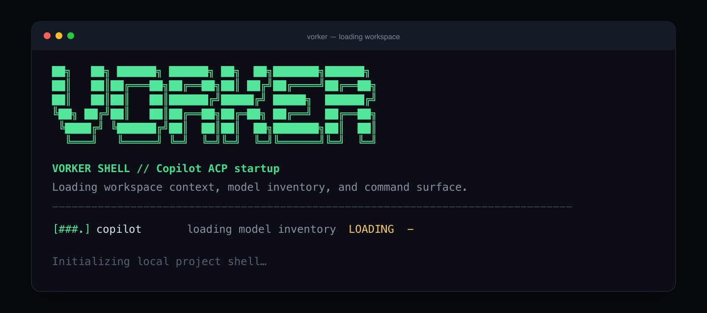
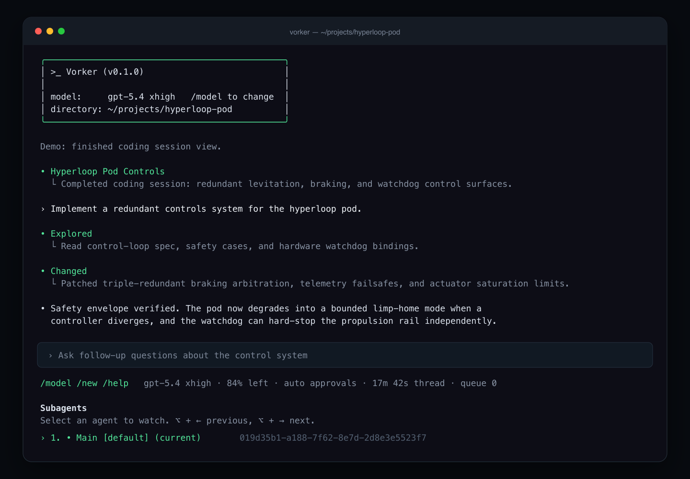
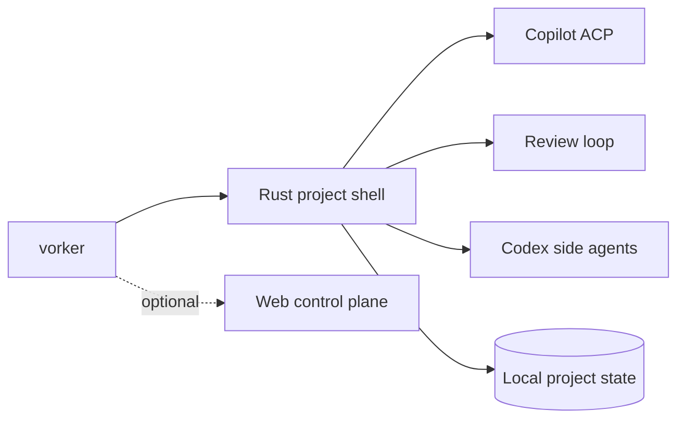

<div align="center">

# Vorker

**A local-first terminal supervisor for AI-assisted development.**

[](#license)

</div>

Vorker wraps a fast Rust shell around Copilot ACP, project context, adversarial review, and Codex-backed side agents. Threads, reports, skills, and agent logs stay local under `~/.vorker`.





## Quick start

Requires Node.js, Rust, and an authenticated [GitHub Copilot CLI](https://docs.github.com/en/copilot/how-tos/set-up/install-copilot-cli).

```bash
git clone https://github.com/lsnchow/vorker-2.git
cd vorker-2
npm ci
npm link
vorker
```

## What it does

- Runs a scrollback-friendly Rust coding shell with slash commands and `@file` context.
- Adds adversarial review, coaching, and patch workflows.
- Spawns bounded Codex side agents for parallel investigation.
- Keeps project threads, history, reports, and skills on your machine.
- Offers an optional web control plane for remote sessions.



## Useful commands

```bash
vorker                                      # open the project shell
vorker adversarial --coach "review this"   # run a coached review
vorker demo hyperloop                       # render the bundled demo
VORKER_PASSWORD=secret vorker serve         # start the local web UI
```

Inside the shell, use `/help`, `/model`, `/review`, `/skills`, `/agent`, `/status`, and `/export`.

## Development

```bash
npm run test:unit
npm run check:all
npm run rust:test
npm run rust:check
```

Vorker is an active prototype; provider-backed flows depend on your local Copilot/Codex setup.

## License

Vorker uses the very permissive [0BSD license](LICENSE): use, copy, modify, or distribute it for any purpose, with or without fee.

<details>
<summary>Full license text</summary>

Copyright (C) 2026 Vorker contributors

Permission to use, copy, modify, and/or distribute this software for any purpose with or without fee is hereby granted.

THE SOFTWARE IS PROVIDED “AS IS” AND THE AUTHOR DISCLAIMS ALL WARRANTIES WITH REGARD TO THIS SOFTWARE INCLUDING ALL IMPLIED WARRANTIES OF MERCHANTABILITY AND FITNESS. IN NO EVENT SHALL THE AUTHOR BE LIABLE FOR ANY SPECIAL, DIRECT, INDIRECT, OR CONSEQUENTIAL DAMAGES OR ANY DAMAGES WHATSOEVER RESULTING FROM LOSS OF USE, DATA OR PROFITS, WHETHER IN AN ACTION OF CONTRACT, NEGLIGENCE OR OTHER TORTIOUS ACTION, ARISING OUT OF OR IN CONNECTION WITH THE USE OR PERFORMANCE OF THIS SOFTWARE.

</details>
